## Term 1, Project 1
# **Finding Lane Lines on the Road**

The goals / steps of this project are the following:
* Make a pipeline that finds lane lines on the road
* Reflect on your work in a written report

[//]: # (Image References)

[image1]: ./grayscale_image.png "Grayscale"
[image2]: ./images/stage1_image.png "Grayscale"
[image3]: ./images/stage2_image.png "Grayscale"
[image4]: ./images/stage3_image.png "Grayscale"
[image5]: ./images/stage4_image.png "Grayscale"
[image6]: ./images/final_result.png "Grayscale"

---

### 1. Describe your pipeline. As part of the description, explain how you modified the draw_lines() function.

Our pipeline consisted of 5 steps:

**Stage 1: Grayscale**
In the first step, the original color image is converted into a grayscale image:
![alt text][image1]

**Stage 2: Gaussian Blur and Canny Edge Detection**
In the second step, we first add some Gaussian blur, followed by an application of an Canny edge filter.
![alt text][image2]
![alt text][image3]
The lanes on both sides of the road are easily recognizable.  In addition, there are reflectors between the lines visible (*Bott's dots*?).

** Stage 3: Region of Interest**
Since we are only interested in the lanes, we apply a mask in order to delete everything which could lead to confusion.  The mask consists of an polygon (more precisely a trapezoid) with the vertices (in counter-clockwise order, starting from the bottom-right): $(960,540), (500,325),(460,325),$ and $(0,540)$.
This results in the following image:
![alt text][image4]

**Stage 4: Hough Transformation**
Perhaps the most important step consists of an application of the so-called Hough transformation.  The resulting family of lines can be sorted by their gradients.  By choosing gradients unequal to zero, we exclude horizontal or almost horizontal lines.  Then we can sort the lines by their gradients having either negative or positive values.
This yields two families of lines parametrized by

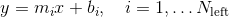

and

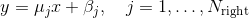

In other words, we have two families of parameters 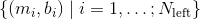 for the left lane and 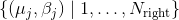 for the right lane.  Note that the gradients for the left lane, 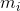, are negative and for those for the right lane, 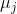, are positive due to our choice of coordinates.

In order to draw two solid lines, we average the line segments on the left lane

and the line segments of the right lane

  

This yields two lines characterized by the gradients

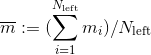

and

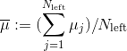

The y-intersections are calculated analogously, i.e. 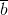 and 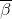 are the averages over 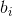, 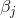, respectively.

Now that we have two lines 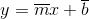 and 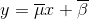, we need to know where to start and stop drawing them on the screen.  We only onsider the left line, the right one goes analogously:  Since we may assume 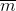, we can consider:

Setting 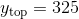 and 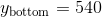 for the top and bottom edges of our *region of interest*, we can now calculate:

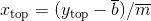

and

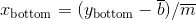

The lines can now be drawn with the help of the OpenCV-routines:

![alt text][image5]

**Stage 5: Adding Weighted Images**
In the last stage, we draw the two lines onto the original picture:
![alt text][image6]

### 2. Identify potential shortcomings with your current pipeline

One potential shortcoming would be when another car obstructs the view onto the road, i.e. higher traffic.  Also, the curvature of the road should not be too great.  What happens if we leave the highway (or more generally a road with limited access)?

Another issue are real-time applications: For these, the algorithm needs to be optimized.  Two contraints: resources and time of processing.

### 3. Suggest possible improvements to your pipeline

One idea to improve the the lane representation is to average the lanes temporarily.  This could smoothen the drawing of the lanes.
